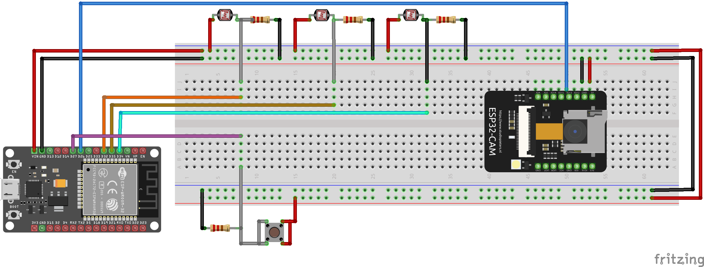

# IoT-Based Solar Panel Project

This project utilizes ESP32 and ESP32-CAM to create an IoT-based solar panel monitoring system. The system is designed to monitor solar panel performance and send data to a server for further analysis.

## Components

- ESP32
- ESP32-CAM
- Breadboard
- Jumper wires
- LDR sensors
- Resistors
- Pushbutton
- Solar panel

## Circuit Diagram

The following is the circuit diagram for the project:

## Source Code

### 1. ESP32

The source code for the ESP32 can be found in the `Iot_Solar_esp32.ino` file. This code is responsible for collecting data from the LDR sensors and sending it to the telegram server.

### 2. ESP32-CAM
The source code for the ESP32-CAM can be found in the `Iot_Solar_esp32_cam.ino` file. This code captures images when a dust is detected or request from the telegram bot and sends them via Telegram.

## How to Use
1. Setup Hardware: Assemble the circuit as shown in the diagram above.
2. Upload Code: Upload the respective code to the ESP32 and ESP32-CAM modules using the Arduino IDE.
3. Configure WiFi: Make sure to update the WiFi and Telegram credentials in both code files.
4. Run the System: Once the code is uploaded and the hardware is set up, the system will start monitoring the solar panel and sending data to the Telegram Bot.

## License

You can use this project for study purposes but not for business purposes. If you want to use it for business purposes, please take permission from the author.

Patent will be filed, so you cannot use this project without permission. Legal action will be taken otherwise.

Contact: divyeshkapadiya25@gmail.com
